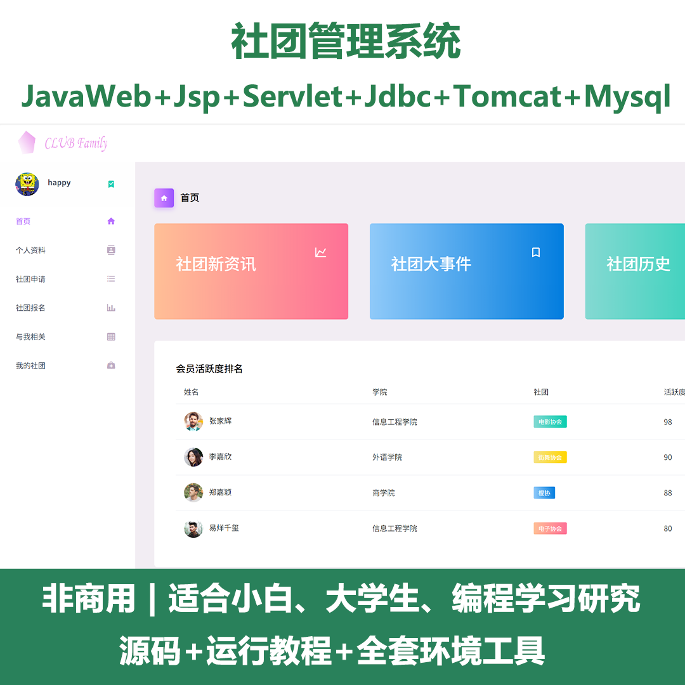
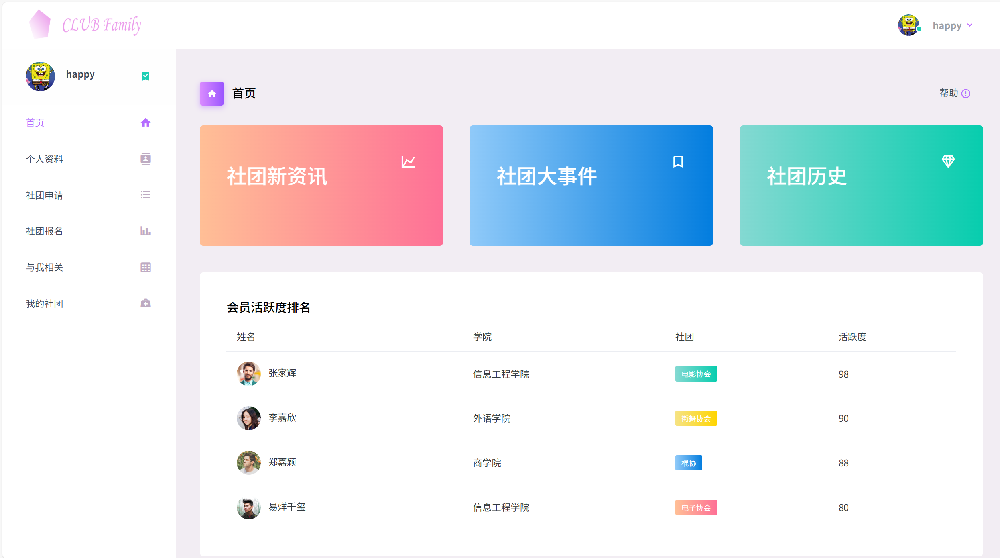
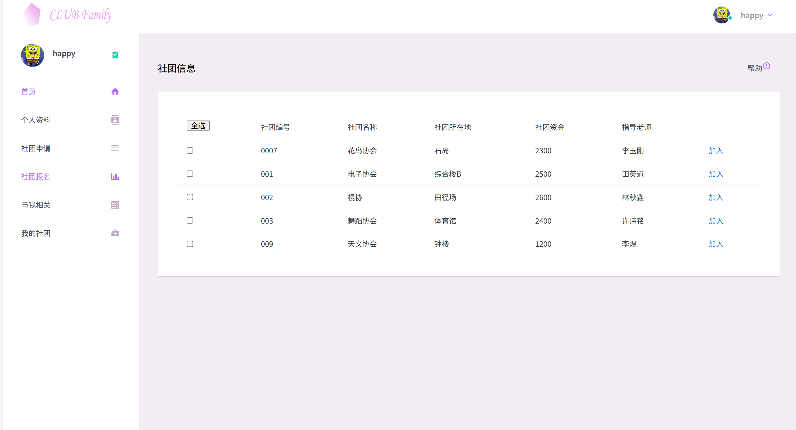
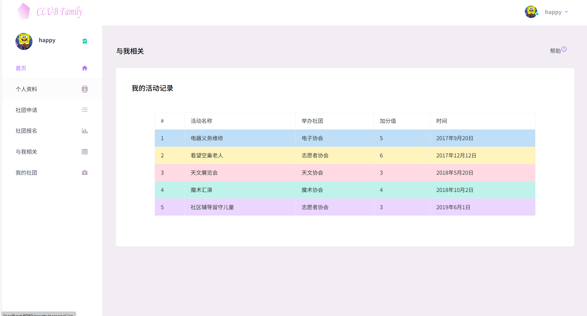
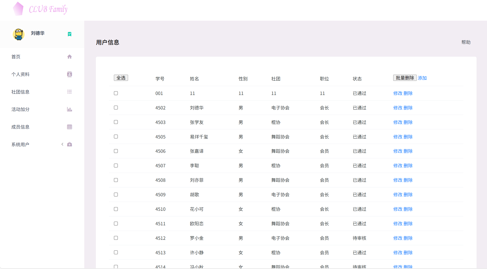
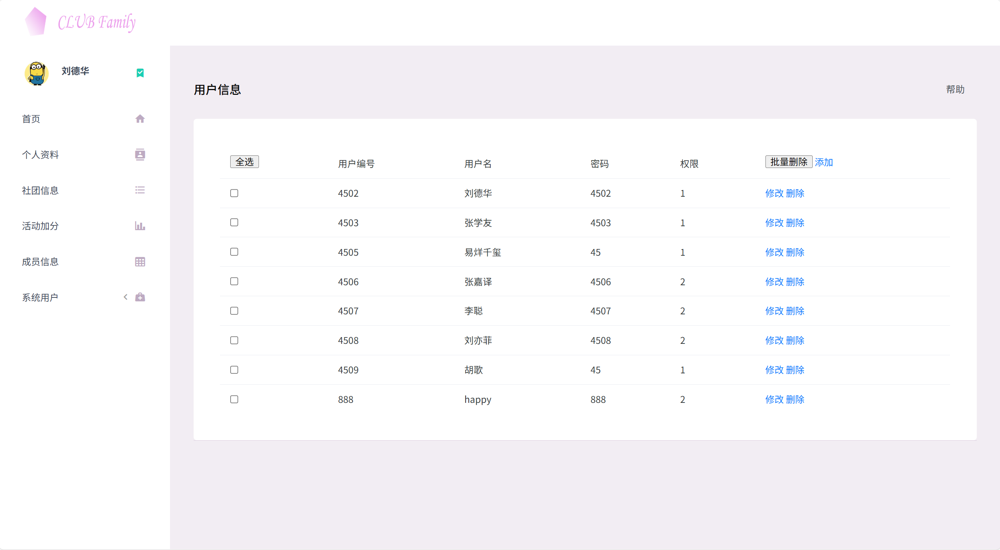
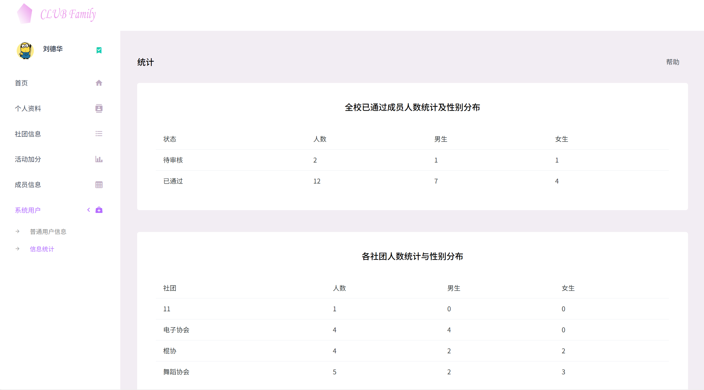

# jspServlet033
jspServlet033社团管理系统
 
## 源码问题查看主页咨询

### 一、关键词

社团管理系统，社团系统

### 二、作品包含
源码+数据库+全套环境和工具资源+本地部署教程

### 三、项目技术
前端技术：Html、Css、Js、Jquery、Bootstrap
后端技术：Java、JSP、Servlet、JDBC

### 四、运行环境（以下版本亲测，其他版本兼容性请自行测试）
开发工具：IDEA/eclipse

数据库：MySQL5.7或8.0

服务器：Tomcat8.5或Tomcat9.0

数据库管理工具：Navicat10以上版本

环境配置软件： JDK1.8

浏览器：谷歌浏览器

### 五、项目介绍
项目编号：jspServlet033

社团系统面向各类学校社团、兴趣社团以及公益社团等，旨在整合社团资源，为社团管理与成员参与社团活动提供一站式解决方案。

该社团管理系统具备首页（展示社团新资讯、社团大事件、社团历史、会员活跃度排名等信息）、个人资料管理、社团信息管理、活动加分管理、成员信息管理、系统用户管理等功能，可满足社团成员信息查看、社团动态了解、成员活跃度统计等多方面需求。

### 六、运行截图

